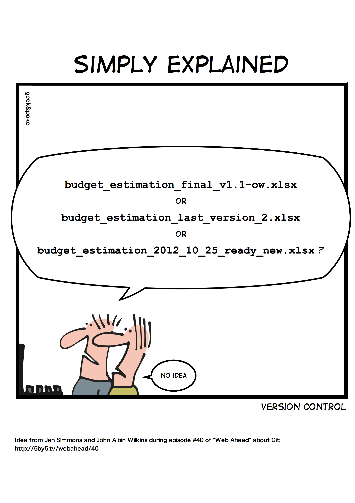

Git Tutorial
============

What is version control?
~~~~~~~~~~~~~~~~~~~~~~~~

Version control is a system that records changes to a file or set of files over time so that you can recall specific versions later.

See:

* https://git-scm.com/book/en/v2/Getting-Started-About-Version-Control

Source: Cartoon by `Geek and Poke <http://geek-and-poke.com/?offset=1352247302000>`_

What is Git?
~~~~~~~~~~~~

Git is is a distributed version-control system for tracking changes in source code during software development.
Git was created by Linus Torvalds in 2005 for development of the Linux kernel.
Git is free and open-source software distributed under GNU General Public License Version 2.

See:

* https://en.wikipedia.org/wiki/Git
* https://git-scm.com/book/en/v2/Getting-Started-What-is-Git%3F

Cheat-Sheet + Quick Start
~~~~~~~~~~~~~~~~~~~~~~~~~

* https://training.github.com/downloads/github-git-cheat-sheet/

Default branch is now main, not master
~~~~~~~~~~~~~~~~~~~~~~~~~~~~~~~~~~~~~~

... at least in Github:

* https://github.blog/changelog/2020-10-01-the-default-branch-for-newly-created-repositories-is-now-main/

Git 2.28 introduced `init.defaultBranch` which allows you to change the name of the default branch,
which used to be `master` when initializing a new Git repository.
If `init.defaultBranch` is unset, the default is still `master`.

See:

* https://github.blog/2020-07-27-highlights-from-git-2-28/
* https://sfconservancy.org/news/2020/jun/23/gitbranchname/

If you encounter this problem when trying to rename your newly created repository:

.. code-block:: console

  % git init
  % git branch -M main
  error: refname refs/heads/master not found
  fatal: Branch rename failed

This is because you haven't committed a file yet:

.. code-block:: console

  % git status
  On branch master

  No commits yet

  nothing to commit (create/copy files and use "git add" to track)

  [ create a file ]

  % git add README.rst
  % git commit -m "Initial commit"
  [master (root-commit) d168377] Initial commit
  % git branch -M main

Links + Best Practices + Tips + Resources
~~~~~~~~~~~~~~~~~~~~~~~~~~~~~~~~~~~~~~~~~

* https://acompiler.com/git-best-practices/#tve-jump-17323b90fc9
* https://acompiler.com/git-tips/
* https://try.github.io/
* https://training.github.com/downloads/github-git-cheat-sheet/
* https://guides.github.com/introduction/git-handbook/
